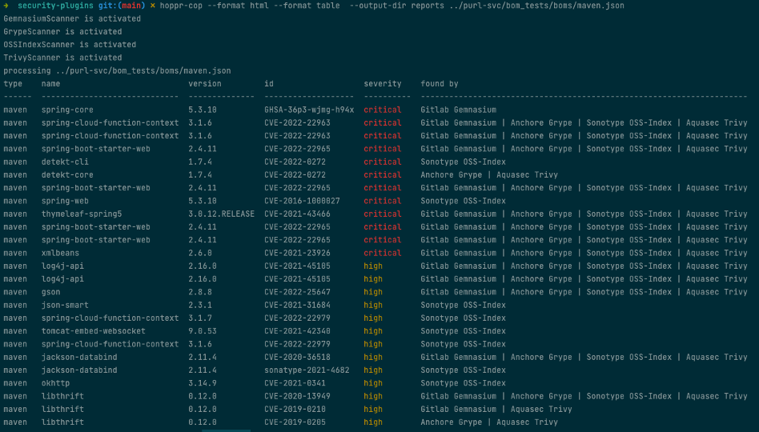

# Hoppr-Cop

Hoppr Cop is a cli and python library that generates high quality vulnerability information from a [cyclone-dx](https://cyclonedx.org/)
Software Bill of Materials (SBOM) by aggregating data from multiple vulnerability databases.
This project is offered as part of the [hoppr](https://hoppr.dev/) ecosystem, however it is fully functional as a standalone cli or python library. 

## Project Status

Alpha 

## Features

* Integrates data from four leading opensource vulnerability databases 
  * [gemnasium community](https://advisories.gitlab.com)
  * [grype](https://github.com/anchore/grype)
  * [trivy](https://aquasecurity.github.io/trivy/v0.31.2/)
  * [oss-index](https://ossindex.sonatype.org/)
* Combines information from these sources in a way that reduces duplicates and ensures complete information for each vulnerability. 
* Generates reports in multiple formats
  * [cyclone-dx vex](https://cyclonedx.org/capabilities/vex/) either embedded in the existing bom or as a standalone file.  
  * [html](https://lmco.gitlab.io/hoppr/utilities/supply-chain-security/hoppr-cop/npm-vulnerabilities.html) - detailed vulnerability information that can be viewed in disconnected networks. 
  * Gitlab Dependency Scanning - Which enables  [Vulnerability Reports](https://docs.gitlab.com/ee/user/application_security/vulnerability_report/),
  [Dependency List](https://docs.gitlab.com/ee/user/application_security/dependency_list/), and [Security Dashboard](https://docs.gitlab.com/ee/user/application_security/security_dashboard/)
  
## Why 

SBOMs provide an ideal way to inventory all the dependencies in a project. A project's vulnerabilities should be monitored on a regular basis. 
`hoppr-cop` provides an easy mechanism to keep your vulnerability information up to date without regenerating an SBOM. 
The vex and html reports provide an ideal way to communicate vulnerability status to users, even in disconnected networks.  

### Why Use Multiple Scanners

- Provides broad coverage of the upstream vulnerability data sources.  You can see the full details of the data-sources [here](docs/data-sources.md). Gitlab and Sonotype provide their own vulnerability reporting that you won't get elsewhere. 
- Provides much better coverage of a variety of package manager types.  Each bom scanner has package managers that it excels at scanning, and some that it does a poor job of.  Additionally, each product supports a different set of package ecosystems.
- Seeing that multiple datasources agree on a finding, improves confidence that the finding is not a false positive. 
- Combining information from multiple sources leads to more complete and accurate information for each vulnerability identified, leading to quicker resolutions. 

## Demo

[](https://asciinema.org/a/sbQOjmD21IpewQEdg6DBVq7iR)

## Installation 

hoppr-cop is available as a python module.   

### Prerequisites

#### Note python 3.10 is required 
The remaining prerequisites are optional, if not performed that scanner will not be activated. 

1. [Install grype](https://github.com/anchore/grype#installation) `curl -sSfL https://raw.githubusercontent.com/anchore/grype/main/install.sh | sh -s -- -b /usr/local/bin`
2. [Install trivy](https://aquasecurity.github.io/trivy/v0.31.2/getting-started/installation/) `curl -sfL https://raw.githubusercontent.com/aquasecurity/trivy/main/contrib/install.sh | sh -s -- -b /usr/local/bin v0.31.2`
3. Register for a [free account with OSS-Index](https://ossindex.sonatype.org/user/register)
   1. Get the api token from your account page.  Export your username and token as `OSS_INDEX_TOKEN` and `OSS_INDEX_USER`

### Install Python Module 

#### Note python 3.10 is required to install the tool

` pip install hoppr-cop --extra-index-url https://gitlab.com/api/v4/projects/38643089/packages/pypi/simple`

### Usage

Note the first time you run the command each day can be quite slow as it downloads the databases.  Subsequent runs should be much more performant. 

## Contributing 

See the [Contribution Guidelines](docs/contributing.md)

## Use as Python Library

This library can also be used programmatically, here is an example of interacting with the combined scanner from pyton code. 
```python
from pathlib import Path

from security_commons.common.reporting.models import ReportFormat
from security_commons.common.reporting.reporting import Reporting
from security_commons.common.utils import parse_sbom
from hopprcop.combined.combined_scanner import CombinedScanner
from hopprcop.gemnasium.gemnasium_scanner import GemnasiumScanner
from hopprcop.grype.grype_scanner import GrypeScanner
from hopprcop.trivy.trivy_scanner import TrivyScanner
from hopprcop.ossindex.oss_index_scanner import OSSIndexScanner

output_dir = Path("./reports")
bom = Path("bom.json")
formats = [ReportFormat.HTML]

reporting = Reporting(output_dir, bom.name.removesuffix(".json"))
combined = CombinedScanner()
combined.set_scanners([GemnasiumScanner(), GrypeScanner(), TrivyScanner, OSSIndexScanner()])
parsed_bom = parse_sbom(bom)
result = combined.get_vulnerabilities_by_sbom(parsed_bom)
reporting.generate_vulnerability_reports(formats, result, parsed_bom)
```


